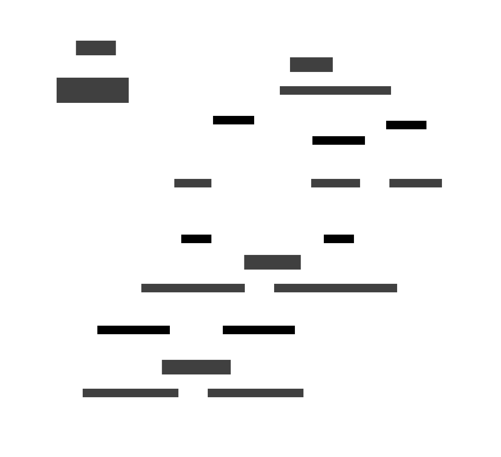

# Property API Reference

> **New to property-based testing?** Start with the [Walkthrough](Walkthrough.md) for a step-by-step guide to creating your first property test. This page provides the complete API reference.

## Overview

`cppproptest` provides a property-based testing framework where you define properties (invariants) that should hold for all inputs in a domain, rather than testing specific examples. The framework automatically generates random inputs and verifies your properties.

<!-- DO NOT DELETE BELOW IMAGE OR KROKI SCRIPT. Script generates to images/property.svg for switching between live and optimized version -->

```kroki-d2

callable : Callable {

    func: |cpp
    [](int a, int b) {
    // test code
    }
    | {
        style {
            stroke: transparent
            fill: transparent
        }
    }

    style.fill : transparent
    shape: page
}

cont: "Property" {

    property: |cpp
    proptest::property(callable)
    |

    propertyforAll: |cpp
    .forAll()
    |

    propertymatrix: |cpp
    .matrix(...)
    |

    example : |cpp
    .example(...)
    |
}

cont2 : Shorthands {

    forAll: |cpp
    proptest::forAll(callable)
    |

    matrix: |cpp
    proptest::matrix(callable, ...)
    |
}

cont3: GTEST Macros {
    expectForAll: |cpp
    EXPECT_FOR_ALL(callable)
    |

    assertForAll: |cpp
    ASSERT_FOR_ALL(callable)
    |
}

cont.property -> cont.propertyForAll : random inputs
cont.property -> cont.propertyMatrix : Cartesian products
cont.property -> cont.example : specific inputs

cont.propertyForAll -- cont2.forAll : shorthand {
  style: {
    stroke-dash: 3
  }
}

cont.propertyMatrix -- cont2.matrix : shorthand {
  style: {
    stroke-dash: 3
  }
}

cont2.forAll -- cont3.expectForAll : Google Test EXPECT_TRUE {
    style.stroke-dash: 3
}

cont2.forAll -- cont3.assertForAll : Google Test ASSERT_TRUE {
    style.stroke-dash: 3
}
```

<!-- -->

## Quick Reference

### Functions

| Function | Description | Returns |
|----------|-------------|---------|
| [`proptest::property(callable, ...generators)`](#proptestpropertycallable-generators) | Create a `Property` object from a callable | `Property` |
| [`proptest::forAll(callable, ...)`](#proptestforallcallable-) | Create and run a property immediately | `bool` |
| [`proptest::matrix(callable, ...lists)`](#proptestmatrixcallable-lists) | Create and run a matrix test immediately | `bool` |

### Property Class Methods

| Method | Description | Returns |
|--------|-------------|---------|
| [`.forAll(...generators)`](#propertyforallgenerators) | Run property with random inputs | `bool` |
| [`.example(...args)`](#propertyexampleargs) | Run property with specific inputs | `bool` |
| [`.matrix(...lists)`](#propertymatrixlists) | Run property with Cartesian product of inputs | `bool` |

### Configuration Methods

All configuration methods return a reference to `Property`, allowing method chaining.

| Method | Description | Parameters |
|--------|-------------|------------|
| [`.setSeed(seed)`](#propertysetseedseed) | Set random seed for reproducibility | `uint64_t seed` |
| [`.setNumRuns(runs)`](#propertysetnumrunsruns) | Set number of test runs | `uint32_t runs` (default: 1000) |
| [`.setMaxDurationMs(duration)`](#propertysetmaxdurationmsduration) | Set maximum test duration in milliseconds | `uint32_t durationMs` |
| [`.setOnStartup(callback)`](#propertysetonstartupcallback) | Set callback called before each test run | `Function<void()> callback` |
| [`.setOnCleanup(callback)`](#propertysetoncleanupcallback) | Set callback called after each test run | `Function<void()> callback` |
| [`.setConfig(config)`](#propertysetconfigconfig) | Configure multiple options at once | `ForAllConfig` (designated initializers) |

### Macros

#### Assertion Macros

| Macro | Type | Description |
|-------|------|-------------|
| [`PROP_ASSERT_EQ(A, B)`](#assertion-macros) | Fatal | Assert equality |
| [`PROP_ASSERT_NE(A, B)`](#assertion-macros) | Fatal | Assert not equal |
| [`PROP_ASSERT_LT(A, B)`](#assertion-macros) | Fatal | Assert less than |
| [`PROP_ASSERT_LE(A, B)`](#assertion-macros) | Fatal | Assert less than or equal |
| [`PROP_ASSERT_GT(A, B)`](#assertion-macros) | Fatal | Assert greater than |
| [`PROP_ASSERT_GE(A, B)`](#assertion-macros) | Fatal | Assert greater than or equal |
| [`PROP_EXPECT_EQ(A, B)`](#assertion-macros) | Non-fatal | Expect equality (continues on failure) |
| [`PROP_EXPECT_NE(A, B)`](#assertion-macros) | Non-fatal | Expect not equal |
| [`PROP_EXPECT_LT(A, B)`](#assertion-macros) | Non-fatal | Expect less than |
| [`PROP_EXPECT_LE(A, B)`](#assertion-macros) | Non-fatal | Expect less than or equal |
| [`PROP_EXPECT_GT(A, B)`](#assertion-macros) | Non-fatal | Expect greater than |
| [`PROP_EXPECT_GE(A, B)`](#assertion-macros) | Non-fatal | Expect greater than or equal |

#### Statistics and Tagging Macros

| Macro | Description |
|-------|-------------|
| [`PROP_STAT(expr)`](#prop_statexpression) | Collect statistics about expression values |
| [`PROP_TAG(key, value)`](#prop_tagkey-value) | Categorize test cases with custom labels |
| [`PROP_CLASSIFY(cond, key, value)`](#prop_classifycondition-key-value) | Conditionally tag test cases |

#### Test Control Macros

| Macro | Description |
|-------|-------------|
| [`PROP_DISCARD()`](#prop_discard) | Skip current test iteration (input doesn't meet preconditions) |
| [`PROP_SUCCESS()`](#prop_success) | Mark current test iteration as passed and skip remaining checks |

#### Google Test Integration Macros

| Macro | Description |
|-------|-------------|
| [`EXPECT_FOR_ALL(...)`](#expect_for_all) | Run `forAll` with `EXPECT_TRUE` (non-fatal) |
| [`ASSERT_FOR_ALL(...)`](#assert_for_all) | Run `forAll` with `ASSERT_TRUE` (fatal) |

&nbsp;

---

## Functions

### `proptest::property(callable, ...generators)`

Creates a `Property` object from a callable (function, functor, or lambda).

**Parameters:**

- `callable`: A callable that defines the property. Can return `bool` or `void` (using assertions).
- `...generators`: Optional generators for property parameters. If not provided, uses default generators (`Arbi<T>`) for each parameter type.

**Returns:** `Property` object

**Example:**
```cpp
auto prop = property([](int a, int b) -> bool {
    return a + b == b + a;
});

// With custom generators
auto prop2 = property([](int a, int b) -> bool {
    return a + b == b + a;
}, gen::interval(0, 100), gen::interval(0, 100));
```

**See also:** [Generators](Generators.md), [Arbitrary](Arbitrary.md), [Custom Generator](CustomGenerator.md)

### `proptest::forAll(callable, ...)`

Shorthand for `property(callable).forAll()`. Creates and immediately runs a property test.

**Parameters:**

- `callable`: A callable that defines the property
- `...`: Optional configuration (C++20 designated initializers) and/or generators

**Returns:** `bool` - `true` if all test runs passed, `false` otherwise

**Example:**
```cpp
// Simple usage
forAll([](int a, int b) -> bool {
    return a + b == b + a;
});

// With configuration
forAll([](int a, int b) -> bool {
    return a + b == b + a;
}, {
    .seed = 12345,
    .numRuns = 500
});

// With generators
forAll([](int a, int b) -> bool {
    return a + b == b + a;
}, gen::interval(0, 100), gen::interval(0, 100));
```

### `proptest::matrix(callable, ...lists)`

Shorthand for `property(callable).matrix(...)`. Creates and immediately runs a matrix test (Cartesian product).

**Parameters:**

- `callable`: A callable that defines the property
- `...lists`: `initializer_list` for each parameter, representing all values to test

**Returns:** `bool`

**Example:**
```cpp
matrix([](int a, int b) -> bool {
    return a + b == b + a;
}, {1, 2, 3}, {4, 5, 6});
```

&nbsp;

---

## Property Class

The `Property` class represents a property test with configurable execution options.

### `Property::forAll(...generators)`

Runs the property with randomly generated inputs.

**Parameters:**

- `...generators`: Optional generators to override or supplement those specified at property creation

**Returns:** `bool` - `true` if all test runs passed, `false` otherwise

**Example:**
```cpp
auto prop = property([](int a, int b) -> bool {
    return a + b == b + a;
});

prop.forAll();  // Use default generators
prop.forAll(gen::interval(0, 100), gen::interval(0, 100));  // Override generators
```

**See also:** [Testing a Property](#testing-a-property), [Configuring test runs](#configuring-test-runs)

### `Property::example(...args)`

Runs the property once with specific input values.

**Parameters:**

- `...args`: Arguments matching the property function's parameters

**Returns:** `bool` - `true` if the property holds for the given inputs, `false` otherwise

**Example:**
```cpp
auto prop = property([](int a, int b) -> bool {
    return a + b == b + a;
});

prop.example(5, 10);
prop.example(INT_MIN, INT_MAX);
```

### `Property::matrix(...lists)`

Runs the property for all combinations of input values (Cartesian product).

**Parameters:**

- `...lists`: `initializer_list` for each parameter

**Returns:** `bool` - `true` if all combinations passed, `false` otherwise

**Example:**
```cpp
auto prop = property([](int a, int b) -> bool {
    return a + b == b + a;
});

// Tests all 9 combinations: (1,4), (1,5), (1,6), (2,4), (2,5), (2,6), (3,4), (3,5), (3,6)
prop.matrix({1, 2, 3}, {4, 5, 6});
```

&nbsp;

---

## Configuration

All configuration methods return a reference to `Property`, allowing method chaining.

### `Property::setSeed(seed)`

Sets the random seed for test execution. Useful for reproducibility.

**Parameters:**

- `seed`: `uint64_t` - Random seed value

**Returns:** `Property&`

**Example:**
```cpp
prop.setSeed(12345).forAll();
```

**Note:** If no seed is specified, current timestamp in milliseconds is used. You can also set it via environment variable `PROPTEST_SEED`.

### `Property::setNumRuns(runs)`

Sets the number of test runs to execute.

**Parameters:**

- `runs`: `uint32_t` - Number of runs (default: 1000)

**Returns:** `Property&`

**Example:**
```cpp
prop.setNumRuns(500).forAll();
```

**Note:** You can set a global default using `PropertyBase::setDefaultNumRuns(num)`.

### `Property::setMaxDurationMs(duration)`

Sets the maximum duration for test execution in milliseconds. Test stops when either the number of runs or duration limit is reached (whichever comes first).

**Parameters:**

- `duration`: `uint32_t` - Maximum duration in milliseconds

**Returns:** `Property&`

**Example:**
```cpp
prop.setMaxDurationMs(5000).forAll();  // Run for at most 5 seconds
```

### `Property::setOnStartup(callback)`

Sets a callback function called before each test run.

**Parameters:**

- `callback`: `Function<void()>` - Callback function

**Returns:** `Property&`

**Example:**
```cpp
prop.setOnStartup([]() {
    std::cout << "Starting test run" << std::endl;
}).forAll();
```

### `Property::setOnCleanup(callback)`

Sets a callback function called after each test run.

**Parameters:**

- `callback`: `Function<void()>` - Callback function

**Returns:** `Property&`

**Example:**
```cpp
prop.setOnCleanup([]() {
    std::cout << "Test run complete" << std::endl;
}).forAll();
```

### `Property::setConfig(config)`

Configures multiple options at once using designated initializers.

**Parameters:**

- `config`: `ForAllConfig` - Configuration struct with optional fields:
  - `.seed`: `uint64_t`
  - `.numRuns`: `uint32_t`
  - `.maxDurationMs`: `uint32_t`
  - `.onStartup`: `Function<void()>`
  - `.onCleanup`: `Function<void()>`

**Returns:** `Property&`

**Example:**
```cpp
prop.setConfig({
    .seed = 12345,
    .numRuns = 1000,
    .maxDurationMs = 5000
}).forAll();
```

**Note:** All fields are optional. This is equivalent to chaining individual setters.

&nbsp;

---

## Assertion Macros

Assertion macros verify conditions within property functions. Fatal assertions (`PROP_ASSERT_*`) stop test execution on failure, while non-fatal expectations (`PROP_EXPECT_*`) continue testing.

**Fatal Assertions:**

- `PROP_ASSERT(condition)` - Assert condition is true
- `PROP_ASSERT_TRUE(condition)` - Assert condition is true
- `PROP_ASSERT_FALSE(condition)` - Assert condition is false
- `PROP_ASSERT_EQ(A, B)` - Assert equality
- `PROP_ASSERT_NE(A, B)` - Assert not equal
- `PROP_ASSERT_LT(A, B)` - Assert less than
- `PROP_ASSERT_LE(A, B)` - Assert less than or equal
- `PROP_ASSERT_GT(A, B)` - Assert greater than
- `PROP_ASSERT_GE(A, B)` - Assert greater than or equal
- `PROP_ASSERT_STREQ(A, B, N)` - Assert string equality (first N characters)

**Non-fatal Expectations:**

- `PROP_EXPECT(condition)` - Expect condition is true
- `PROP_EXPECT_TRUE(condition)` - Expect condition is true
- `PROP_EXPECT_FALSE(condition)` - Expect condition is false
- `PROP_EXPECT_EQ(A, B)` - Expect equality
- `PROP_EXPECT_NE(A, B)` - Expect not equal
- `PROP_EXPECT_LT(A, B)` - Expect less than
- `PROP_EXPECT_LE(A, B)` - Expect less than or equal
- `PROP_EXPECT_GT(A, B)` - Expect greater than
- `PROP_EXPECT_GE(A, B)` - Expect greater than or equal
- `PROP_EXPECT_STREQ(A, B, N)` - Expect string equality (first N characters)

**Example:**
```cpp
forAll([](int a, int b) {
    PROP_ASSERT_EQ(a + b, b + a);  // Fatal - stops on failure
    PROP_EXPECT_GE(a + b, a);      // Non-fatal - continues on failure
});
```

**See also:** [Controlling Test Execution](#controlling-test-execution)

&nbsp;

## Statistics and Tagging Macros

### `PROP_STAT(expression)`

Collects statistics about expression values. The expression is evaluated for each test run, and a summary is printed at the end showing the distribution of results.

**Example:**
```cpp
forAll([](float f) {
    PROP_STAT(std::isfinite(f));
    PROP_STAT(f > 0);
    PROP_STAT(f < 0);
}, gen::float32(0.05, 0.05, 0.05));
```

**See also:** [Test Strategies](TestStrategies.md)

### `PROP_TAG(key, value)`

Categorizes test cases with custom key-value pairs. Both key and value are expressions that are evaluated.

**Example:**
```cpp
forAll([](int x) {
    if (x < 0) {
        PROP_TAG("sign", "negative");
    } else if (x > 0) {
        PROP_TAG("sign", "positive");
    } else {
        PROP_TAG("sign", "zero");
    }
});
```

### `PROP_CLASSIFY(condition, key, value)`

Convenience macro that conditionally applies a tag. Equivalent to `if (condition) PROP_TAG(key, value)`.

**Example:**
```cpp
forAll([](int x, int y) {
    PROP_CLASSIFY(x == y, "relationship", "equal");
    PROP_CLASSIFY(x > y, "relationship", "greater");
    PROP_CLASSIFY(x < y, "relationship", "less");
});
```

&nbsp;

## Test Control Macros

### `PROP_DISCARD()`

Skips the current test iteration. The iteration doesn't count toward the total number of runs, and the test will generate additional inputs to meet the configured number of successful runs.

**Use case:** When generated inputs don't meet preconditions for your property test.

**Example:**
```cpp
forAll([](int x, int y) {
    if (y == 0) {
        PROP_DISCARD();  // Skip division by zero cases
    }
    int result = x / y;
    PROP_ASSERT(result * y <= x);
});
```

**Note:** If too many cases are discarded, consider using `gen::filter()` at the generator level instead. See [Combinators](Combinators.md).

### `PROP_SUCCESS()`

Immediately marks the current test iteration as successful and skips any remaining assertions or checks in the property function.

**Use case:** Early exit for trivial cases that you know will pass, optimizing test execution time.

**Example:**
```cpp
forAll([](int x, int y) {
    if (x == 0 || y == 0) {
        PROP_SUCCESS();  // Skip expensive checks for trivial cases
    }
    PROP_ASSERT(complexProperty(x, y));
});
```

&nbsp;

## Google Test Integration Macros

### `EXPECT_FOR_ALL(...)`

Shorthand for `EXPECT_TRUE(proptest::forAll(...))`. Non-fatal - continues testing on failure.

**Example:**
```cpp
TEST(Arithmetic, Commutativity)
{
    EXPECT_FOR_ALL([](int a, int b) {
        PROP_ASSERT_EQ(a + b, b + a);
    });
}
```

### `ASSERT_FOR_ALL(...)`

Shorthand for `ASSERT_TRUE(proptest::forAll(...))`. Fatal - stops test execution on failure.

**Example:**
```cpp
TEST(Arithmetic, Commutativity)
{
    ASSERT_FOR_ALL([](int a, int b) {
        PROP_ASSERT_EQ(a + b, b + a);
    });
}
```

&nbsp;

---

## Usage Examples

### Basic Property Test

```cpp
#include "proptest/proptest.hpp"
#include <gtest/gtest.h>

using namespace proptest;

TEST(Arithmetic, AdditionIsCommutative)
{
    forAll([](int a, int b) -> bool {
        return a + b == b + a;
    });
}
```

### Using Assertions

```cpp
TEST(Arithmetic, AdditionIsCommutativeWithAssertions)
{
    forAll([](int a, int b) {
        PROP_ASSERT_EQ(a + b, b + a);
    });
}
```

### Custom Generators

```cpp
TEST(Arithmetic, AdditionWithCustomRange)
{
    forAll([](int a, int b) {
        PROP_ASSERT_EQ(a + b, b + a);
    }, gen::interval(0, 100), gen::interval(0, 100));
}
```

### Configuration

```cpp
TEST(StringUtils, ReverseWithConfiguration)
{
    auto prop = property([](const std::string& original) {
        std::string reversed = reverseString(original);
        std::string reversedTwice = reverseString(reversed);
        PROP_ASSERT_EQ(original, reversedTwice);
    });

    prop.setNumRuns(500)
        .setSeed(12345)
        .setMaxDurationMs(5000)
        .forAll();
}
```

### Batch Configuration

```cpp
TEST(StringUtils, ReverseWithBatchConfig)
{
    auto prop = property([](const std::string& original) {
        std::string reversed = reverseString(original);
        std::string reversedTwice = reverseString(reversed);
        PROP_ASSERT_EQ(original, reversedTwice);
    });

    prop.setConfig({
        .seed = 12345,
        .numRuns = 500,
        .maxDurationMs = 5000
    }).forAll();
}
```

### Testing Specific Examples

```cpp
TEST(StringUtils, ReverseEdgeCases)
{
    auto prop = property([](const std::string& s) {
        PROP_ASSERT_EQ(s.length(), reverseString(s).length());
    });

    prop.example("");
    prop.example("a");
    prop.example("hello world");
}
```

### Matrix Testing

```cpp
TEST(Arithmetic, BoundaryCases)
{
    auto prop = property([](int a, int b) -> bool {
        return a + b == b + a;
    });

    prop.matrix({INT_MIN, 0, INT_MAX}, {INT_MIN, 0, INT_MAX});
}
```

### Statistics Collection

```cpp
TEST(Statistics, InputDistribution)
{
    forAll([](int value) {
        PROP_STAT(value > 0);
        PROP_STAT(value < 0);
        PROP_STAT(value == 0);
        PROP_TAG("magnitude", value > 100 ? "large" : "small");

        PROP_ASSERT_GE(value * value, 0);
    });
}
```

### Discarding Invalid Inputs

```cpp
TEST(Division, NonZeroDenominator)
{
    forAll([](int x, int y) {
        if (y == 0) {
            PROP_DISCARD();  // Skip division by zero
        }
        int result = x / y;
        PROP_ASSERT(result * y <= x);
    });
}
```

&nbsp;

---

## Related Topics

- [Walkthrough](Walkthrough.md) - Step-by-step guide to creating property tests
- [Generators](Generators.md) - Complete guide to input generators
- [Arbitrary](Arbitrary.md) - Default generators for types
- [Custom Generator](CustomGenerator.md) - Creating generators for custom types
- [Combinators](Combinators.md) - Combining and transforming generators
- [Generator Examples](GeneratorExamples.md) - Real-world generator usage
- [Shrinking](Shrinking.md) - How counterexamples are simplified
- [Test Strategies](TestStrategies.md) - Advanced testing techniques
- [Stateful Testing](StatefulTesting.md) - Testing state machines
- [Concurrency Testing](ConcurrencyTesting.md) - Testing concurrent code
